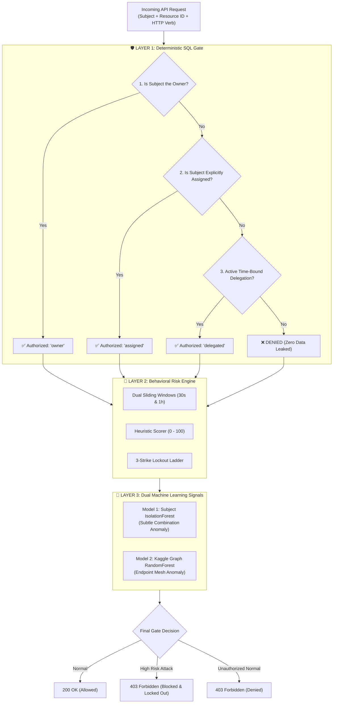
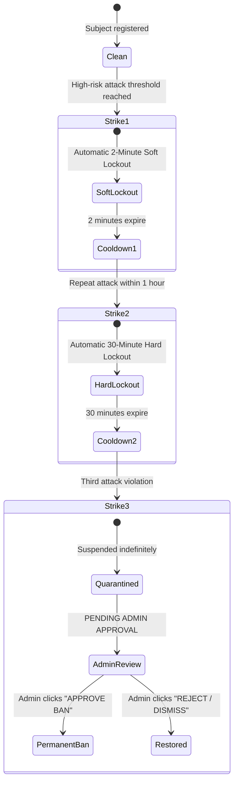

# CyberAccess BOLA Defense: The Complete Plain-English Master Guide
*A comprehensive, zero-jargon architectural and technical breakdown of Broken Object Level Authorization (OWASP API1:2023), its real-world dangers, and how CyberAccess solves it with deterministic gates, behavioral intelligence, dual machine learning, and 9 advanced defense vectors.*

---

## 📑 Table of Contents
1. [Introduction: The Invisible Lock on the Internet's Doors](#1-introduction-the-invisible-lock-on-the-internets-doors)
2. [What is BOLA / IDOR? (Explained for Everyone)](#2-what-is-bola--idor-explained-for-everyone)
   - [The Hotel Room Analogy](#the-hotel-room-analogy)
   - [Why Traditional Firewalls & API Gateways Completely Miss It](#why-traditional-firewalls--api-gateways-completely-miss-it)
   - [The False Alarm vs. Blindspot Dilemma](#the-false-alarm-vs-blindspot-dilemma)
3. [The CyberAccess Defense Philosophy](#3-the-cyberaccess-defense-philosophy)
   - [Deterministic-First vs. Probabilistic-First](#deterministic-first-vs-probabilistic-first)
   - [The Three-Tier Shield Architecture](#the-three-tier-shield-architecture)
4. [Deep Dive: Layer 1 — The Deterministic SQL Authorization Gate](#4-deep-dive-layer-1--the-deterministic-sql-authorization-gate)
   - [The 3 Keys: Owner, Assignment, and Time-Bound Delegation](#the-3-keys-owner-assignment-and-time-bound-delegation)
   - [Zero Data Leakage & Identical Denial Text](#zero-data-leakage--identical-denial-text)
5. [Deep Dive: Layer 2 — The Behavioral Risk Engine](#5-deep-dive-layer-2--the-behavioral-risk-engine)
   - [Dual Sliding Windows: 30-Second Sprint vs. 1-Hour Marathon](#dual-sliding-windows-30-second-sprint-vs-1-hour-marathon)
   - [Risk Scoring Formulas & Heuristics (0 to 100)](#risk-scoring-formulas--heuristics-0-to-100)
   - [The 3-Strike Escalation Ladder & Human-in-the-Loop Review](#the-3-strike-escalation-ladder--human-in-the-loop-review)
6. [Deep Dive: Layer 3 — Dual Machine Learning Signals](#6-deep-dive-layer-3--dual-machine-learning-signals)
   - [Model 1: Subject Behavioral Anomaly (Unsupervised Isolation Forest)](#model-1-subject-behavioral-anomaly-unsupervised-isolation-forest)
   - [Model 2: Endpoint Access Graph Anomaly (Supervised Kaggle Random Forest)](#model-2-endpoint-access-graph-anomaly-supervised-kaggle-random-forest)
7. [The 9 Advanced BOLA Defense Vectors (Fully Detailed)](#7-the-9-advanced-bola-defense-vectors-fully-detailed)
   - [Vector 1: Write & Mutation BOLA (PUT, PATCH, DELETE Risk Weighting)](#vector-1-write--mutation-bola-put-patch-delete-risk-weighting)
   - [Vector 2: Broken Hierarchical Parent-Child Traversal](#vector-2-broken-hierarchical-parent-child-traversal)
   - [Vector 3: Body Payload Object Injection](#vector-3-body-payload-object-injection)
   - [Vector 4: Batch & Bulk Array Probing](#vector-4-batch--bulk-array-probing)
   - [Vector 5: Asynchronous Background Job Context Propagation](#vector-5-asynchronous-background-job-context-propagation)
   - [Vector 6: GraphQL AST Traversal & Field Resolvers](#vector-6-graphql-ast-traversal--field-resolvers)
   - [Vector 7: Second-Order Stored BOLA](#vector-7-second-order-stored-bola)
   - [Vector 8: Dynamic Attribute-Based Access Control (ABAC) & Real-Time Masking](#vector-8-dynamic-attribute-based-access-control-abac--real-time-masking)
   - [Vector 9: Honeypot Canary Traps & Active Deception](#vector-9-honeypot-canary-traps--active-deception)
8. [Multi-Tenant Product API & Developer SDKs](#8-multi-tenant-product-api--developer-sdks)
   - [Postgres Multi-Tenant Isolation](#postgres-multi-tenant-isolation)
   - [The Product API (`POST /v1/authorize` & `POST /v1/authorize-batch`)](#the-product-api-post-v1authorize--post-v1authorize-batch)
   - [Python SDK: Synchronous & Asynchronous (`AsyncCyberAccessClient`)](#python-sdk-synchronous--asynchronous-asynccyberaccessclient)
   - [FastAPI Drop-In Enforcers](#fastapi-drop-in-enforcers)
9. [The Frontend Security & Threat Intelligence Center](#9-the-frontend-security--threat-intelligence-center)
   - [Live Threat Radar & Probe Workbench](#live-threat-radar--probe-workbench)
   - [Interactive Advanced BOLA Defense Lab](#interactive-advanced-bola-defense-lab)
   - [Dynamic ABAC & Redaction Explorer](#dynamic-abac--redaction-explorer)
   - [Canary Honeypot Matrix](#canary-honeypot-matrix)
   - [Empirical Benchmark Evaluation Hub](#empirical-benchmark-evaluation-hub)
   - [Real-Time Server-Sent Events (SSE) Streaming & Crimson Banner](#real-time-server-sent-events-sse-streaming--crimson-banner)
10. [The Empirical Multi-Dataset Benchmark (6 Suites)](#10-the-empirical-multi-dataset-benchmark-6-suites)
    - [The 6 Benchmark Suites Explained](#the-6-benchmark-suites-explained)
    - [Evaluation Matrix & Results Breakdown](#evaluation-matrix--results-breakdown)
11. [How to Run, Test, and Verify Everything](#11-how-to-run-test-and-verify-everything)
12. [Glossary of Terms](#12-glossary-of-terms)

---

## 1. Introduction: The Invisible Lock on the Internet's Doors

Every day, billions of API requests pass through banks, hospitals, ride-sharing platforms, and social networks. When you check your medical vitals on a healthcare app, transfer money on your mobile banking app, or view a private invoice, an **Application Programming Interface (API)** is working silently behind the scenes.

Most people assume that once you log in with your email and password, the system keeps your data safe. **It doesn't.**

Logging in only tells the computer **who you are** (Authentication). It does not automatically guarantee that you are allowed to see or modify **what you are looking at** (Object-Level Authorization). 

When an API fails to check whether the person asking for a specific document actually has the right to see that specific document, the entire security perimeter collapses. This fatal flaw is called **BOLA** (**Broken Object Level Authorization**), historically known as **IDOR** (**Insecure Direct Object Reference**).

According to the Open Web Application Security Project (OWASP), **BOLA is the #1 most critical API vulnerability in the world** (OWASP API1:2023). It has been responsible for massive real-world data breaches exposing hundreds of millions of patient health records, tax forms, private messages, and customer bank accounts across Fortune 500 companies.

CyberAccess was engineered to solve this crisis once and for all—not with guesswork, but with a battle-tested, deterministic-first security architecture.

---

## 2. What is BOLA / IDOR? (Explained for Everyone)

### The Hotel Room Analogy
Imagine you check into a large hotel. 

```
┌─────────────────────────────────────────────────────────────┐
│                      THE HOTEL ANALOGY                      │
├─────────────────────────────────────────────────────────────┤
│ 1. You show your passport at reception (Authentication)    │
│    -> The receptionist hands you a badge: "You are Alice"   │
│                                                             │
│ 2. Your room is Room #101.                                  │
│    -> You walk up to Room #101 and unlock your door.        │
│                                                             │
│ 3. You walk down the hallway to Room #102.                  │
│    -> You turn the handle. If Room #102 opens for your key, │
│       THE HOTEL HAS A BOLA VULNERABILITY!                   │
└─────────────────────────────────────────────────────────────┘
```

In a vulnerable software application, an API request looks like this:
```http
GET /records/101
Authorization: Bearer alice_token
```
The server checks Alice's token. The server says: *"Alice is logged in! Here is Record #101."*

Then Alice (or a malicious hacker) changes a single digit in the URL:
```http
GET /records/102
Authorization: Bearer alice_token
```
In a broken API, the server checks the token: *"Alice is logged in! Here is Record #102."*
The server **never asked**: *"Does Record #102 belong to Alice?"*

Because database IDs are often numbers (`1, 2, 3...`) or predictable strings, an attacker can write a tiny script that loops from `1` to `1,000,000` and downloads the entire database in minutes.

---

### Why Traditional Firewalls & API Gateways Completely Miss It

Traditional cybersecurity tools (Web Application Firewalls like Cloudflare, AWS WAF, or basic API gateways) are built to detect **malformed code** or **brute force volume**:
- They look for SQL Injection: `SELECT * FROM users WHERE '1'='1'`
- They look for Cross-Site Scripting (XSS): `<script>alert(1)</script>`
- They look for massive DDoS attacks sending 100,000 requests per second.

**BOLA looks like 100% normal, innocent traffic.**
When an attacker requests `GET /records/102`, the request contains:
- Valid HTTP syntax
- A completely valid, officially signed login token
- A standard integer ID
- Normal headers

To a standard firewall, `GET /records/102` is indistinguishable from legitimate customer traffic. The firewall lets it pass right through.

---

### The False Alarm vs. Blindspot Dilemma

In recent years, modern venture-backed API security vendors attempted to solve BOLA using purely **probabilistic Machine Learning (ML) anomaly detection**. 

This created two fatal real-world problems:

```mermaid
graph TD
    subgraph Problem1["🚨 Problem 1: False Positive Nightmare"]
        Doc["Legitimate Doctor covers emergency ward"] --> Burst["Accesses 40 new patient charts in 2 minutes"]
        Burst --> PureML["Probabilistic ML Baseline"]
        PureML --> Block["❌ BLOCKED! Flagged as BOLA attacker!"]
        Block --> Disaster["Critical clinical care delayed"]
    end

    subgraph Problem2["🥷 Problem 2: The Low-and-Slow Blindspot"]
        Hacker["Stealth Adversary"] --> Slow["Probes 1 foreign record every 4 minutes"]
        Slow --> PureML2["Probabilistic ML Baseline"]
        PureML2 --> Pass["✅ Allowed! Blends into background noise"]
        Pass --> Breach["Entire database silently stolen"]
    end
```



1. **The False Positive Nightmare:** If an on-call emergency room physician suddenly accesses 35 patient vitals because she is covering a shift, a purely ML-based tool sees a sudden deviation from her baseline and **blocks her access**, directly endangering patient lives.
2. **The Low-and-Slow Blindspot:** If an attacker writes a bot that requests only 1 unauthorized record every 4 minutes, the traffic volume stays far below any statistical anomaly threshold. The attacker steals the entire database over weeks without tripping a single alert.

CyberAccess eliminates both problems by refusing to let probabilistic guesswork make authorization decisions.

---

## 3. The CyberAccess Defense Philosophy

CyberAccess is built on a fundamental principle:
> **Authorization is an absolute boolean truth, not a statistical guess. Telemetry and behavioral algorithms exist to protect the gateway, isolate attackers, and alert SecOps, but the access decision itself must be mathematically deterministic.**



---

## 4. Deep Dive: Layer 1 — The Deterministic SQL Authorization Gate

Layer 1 is the immutable iron vault. It lives at the database layer and enforces access rights using exact relational logic.

### The 3 Keys: Owner, Assignment, and Time-Bound Delegation

Whenever an identity (the "Subject") requests an object (the "Resource"), CyberAccess checks three strictly prioritized criteria:

| Priority | Access Type | How it Works in Real Life | Real-World Example |
| :--- | :--- | :--- | :--- |
| **1st** | **Ownership** | You created or own the record. You have full read, update, and delete privileges. | Alice viewing or updating her own medical chart. |
| **2nd** | **Assignment** | A formal institutional assignment exists linking your identity to the record. | Dr. Singh assigned as the primary attending cardiologist for Patient #1. |
| **3rd** | **Delegation** | A temporary, time-bound access grant approved by an administrator with an exact expiration timestamp. | Support agent Amy given 1-hour access to Patient #17 to resolve a billing ticket. |

If a request satisfies none of these three criteria, **access is immediately denied**.

### Zero Data Leakage & Identical Denial Text

A classic mistake made by novice engineers is leaking information through error messages:
- Requesting an unauthorized record that exists: `403 Forbidden: You do not own record #55`
- Requesting an unauthorized record that does *not* exist: `404 Not Found: Record #999 does not exist`

Attackers use this difference as an **Oracle**—they can scan millions of IDs to see which ones exist without ever seeing the contents!

**The CyberAccess Standard:**
CyberAccess returns the exact same denial message whether the record exists, doesn't exist, is owned by a CEO, or is owned by a standard user:
```json
{
  "outcome": "denied",
  "reason": "No valid object-level authorization",
  "explanations": ["Access denied: you do not have permission to access this record."]
}
```
Zero timing differentials, zero existence cues, zero metadata leaked.

---

## 5. Deep Dive: Layer 2 — The Behavioral Risk Engine

While Layer 1 blocks unauthorized attempts, Layer 2 analyzes the **pattern of behavior** across time to determine whether the user is a normal employee who made a simple typo, or an active adversary enumerating the database.

### Dual Sliding Windows: 30-Second Sprint vs. 1-Hour Marathon

Attackers operate in two main speeds:
1. **Rapid Automated Probing:** Scripts that try dozens of IDs in a few seconds.
2. **Low-and-Slow Reconnaissance:** Scripts that probe once every few minutes to evade simple rate limits.

CyberAccess solves this by maintaining **two concurrent sliding memory windows** for every identity:

```
┌────────────────────────────────────────────────────────────────────────┐
│                        DUAL SLIDING TIME WINDOWS                       │
├────────────────────────────────────────────────────────────────────────┤
│ SHORT WINDOW (30 Seconds):                                             │
│ [ ... probe ... probe ... probe ... probe ] -> Rapid Burst Detected!   │
│ Threshold: >= 4 unique denied objects in 30s -> Trips Alarm            │
├────────────────────────────────────────────────────────────────────────┤
│ LONG WINDOW (3,600 Seconds / 1 Hour):                                  │
│ [ probe ................. probe ................. probe ]              │
│ Threshold: >= 15 unique denied objects across 1 hour -> Trips Alarm    │
└────────────────────────────────────────────────────────────────────────┘
```

### Risk Scoring Formulas & Heuristics (0 to 100)

Every request is evaluated by the behavioral engine, which computes a dynamic score from **0 (Completely Safe)** to **100 (Active Attack)** based on additive risk contributions:

$$\text{Risk Score} = \min\left(100, \sum \text{Contributions}\right)$$

| Signal Tripped | Points Added | Plain-English Explanation |
| :--- | :---: | :--- |
| `unauthorized_unique_object_pressure` | **+40** | The subject tried to access $\ge 4$ different forbidden records in 30 seconds. |
| `sequential_id_enumeration` | **+35** | The subject is guessing numbers in a row (e.g., records 10, 11, 12, 13). |
| `low_and_slow_reconnaissance` | **+50** | The subject has probed $\ge 15$ forbidden records over the past hour. |
| `high_failure_ratio` | **+20** | Over 50% of the subject's requests are failing with access denials. |
| `endpoint_diversity` | **+20** | The subject is probing across multiple different API endpoints simultaneously (`/records`, `/invoices`, `/users`). |
| `unauthorized_write_delete_attempt` | **+75** | The subject attempted to execute an unauthorized `DELETE` request. |
| `unauthorized_write_mutation_attempt` | **+30 to +40** | The subject attempted an unauthorized `PUT` or `PATCH` modification. |
| `relational_chain_mismatch` | **+45** | The subject tried to bypass parent-child hierarchies. |
| `body_payload_object_injection` | **+20 to +40** | The subject smuggled foreign IDs into a JSON request body. |
| `canary_honeypot_triggered` | **+100** | The subject accessed an active honeypot decoy record. |

#### Risk Categories
- **0 – 39**: `Normal` (Legitimate traffic, accidental typos, or standard navigation).
- **40 – 69**: `Suspicious` (Unusual activity; triggers increased telemetry logging).
- **70 – 89**: `High Risk` (Hostile pattern detected; warnings attached to response headers).
- **90 – 100**: `Attack` (Enforces automatic execution blocking and lockout).

---

### The 3-Strike Escalation Ladder & Human-in-the-Loop Review

CyberAccess believes that **automated systems should never permanently ban a user without human oversight**, because false positives can ruin customer relationships. Instead, CyberAccess implements a graduated 3-strike escalation ladder:



1. **Strike 1 (2-Minute Soft Lockout):** Stops automated scrapers in their tracks. Normal users who made an honest mistake regain access in 120 seconds.
2. **Strike 2 (30-Minute Hard Lockout):** If the identity resumes probing within 1 hour of Strike 1, the penalty jumps to a half-hour lockdown.
3. **Strike 3 (Quarantine & Human-in-the-Loop Review):** The identity is completely blocked from the API. However, the firewall places the user into a **Pending Admin Approval** queue. A Security Operations Center (SOC) analyst reviews the full forensic audit trail and makes the final human decision:
   - Click **Approve Ban**: Enforces an immutable permanent blacklist.
   - Click **Dismiss Ban**: Clears the quarantine if the incident was verified as an authorized emergency action.

---

## 6. Deep Dive: Layer 3 — Dual Machine Learning Signals

To catch attacks that deliberately stay right underneath heuristic thresholds, CyberAccess incorporates two distinct machine learning models.

```
┌────────────────────────────────────────────────────────────────────────┐
│                   CYBERACCESS DUAL MACHINE LEARNING                    │
├────────────────────────────────────────────────────────────────────────┤
│ MODEL 1: Subject-Level Behavioral Anomaly                              │
│ - Algorithm: Unsupervised Isolation Forest (scikit-learn)             │
│ - Role: Evaluates multi-dimensional shapes of user activity.           │
│ - Input: [Denied Short, Sequentiality, Denied Long, Failure Ratio, ...]│
│ - Output: Triggers 'ml_behavioral_anomaly' (+15 risk score)           │
├────────────────────────────────────────────────────────────────────────┤
│ MODEL 2: Endpoint Graph Telemetry Anomaly                              │
│ - Algorithm: Supervised Random Forest Classifier (Kaggle trained)      │
│ - Dataset: 36,000 real-world API access telemetry vectors (Tangodelta) │
│ - Role: Detects distributed Sybil attacks across an endpoint mesh.     │
│ - Input: Inter-arrival time, uniqueness, session counts, IP entropy   │
│ - Output: Endpoint graph risk classification (ROC-AUC 1.00)            │
└────────────────────────────────────────────────────────────────────────┘
```

### Model 1: Subject Behavioral Anomaly (Unsupervised Isolation Forest)
- **Why it is needed:** An attacker might try 3 unique IDs in 29 seconds (just under the threshold of 4), with a failure ratio of 48% (just under 50%), while hitting 1 endpoint. Individually, every single heuristic says "OK".
- **How it works:** The Isolation Forest looks at the **5-dimensional geometry** of the subject's traffic simultaneously. It notices that this specific combination of features is statistically anomalous compared to the population distribution of normal users, and flags `ml_behavioral_anomaly`.

### Model 2: Endpoint Access Graph Anomaly (Supervised Kaggle Random Forest)
- **Why it is needed:** What if an attacker creates 50 different bot accounts (a **Sybil Attack**)? Each bot account only makes **one single request** to the target record. To the subject-level engine, each bot looks completely innocent!
- **How it works:** Model 2 does not look at the user; it looks at the **Target Record**. It calculates the access graph around that record:
  - How many unique users touched this record in the last 10 minutes?
  - What is the variance of inter-arrival times?
  - What is the IP entropy?
  When 50 different accounts suddenly target Record #1, Model 2 flags the target endpoint as an anomalous target of a coordinated distributed attack.

---

## 7. The 9 Advanced BOLA Defense Vectors (Fully Detailed)

Most security guides treat BOLA as a simple `GET /records/1` problem. In modern enterprise applications, BOLA attacks manifest in **9 sophisticated variations**. CyberAccess provides dedicated defense algorithms for each:

```
┌─────────────────────────────────────────────────────────────────────────┐
│                    THE 9 ADVANCED BOLA DEFENSE VECTORS                  │
├─────────────────────────────────────────────────────────────────────────┤
│ Vector 1: Write & Mutation BOLA (PUT/PATCH/DELETE)                      │
│ Vector 2: Broken Hierarchical Parent-Child Traversal                    │
│ Vector 3: Body Payload Object Injection                                 │
│ Vector 4: Batch & Bulk Array Probing                                    │
│ Vector 5: Asynchronous Background Job Context Propagation               │
│ Vector 6: GraphQL AST Traversal & Field Resolvers                       │
│ Vector 7: Second-Order Stored BOLA                                      │
│ Vector 8: Dynamic Attribute-Based Access Control (ABAC) & Redaction     │
│ Vector 9: Honeypot Canary Traps & Active Deception                      │
└─────────────────────────────────────────────────────────────────────────┘
```

---

### Vector 1: Write & Mutation BOLA (PUT, PATCH, DELETE Risk Weighting)
- **The Threat:** Reading another user's data is bad; **modifying or deleting** another user's data is catastrophic. In many applications, an engineer protects `GET /records/123`, but forgets to secure `PUT /records/123` or `DELETE /records/123`.
- **The Real-World Danger:** A malicious user overwrites a competitor's invoice amounts, or deletes patient medical records from the hospital database.
- **CyberAccess Defense:** 
  - `DELETE` requests are strictly restricted to the verified record owner. Even delegates cannot delete records.
  - The Behavioral Engine applies **asymmetric risk multipliers**: an unauthorized `DELETE` attempt carries an immediate $+75$ risk penalty (3.0x multiplier), triggering immediate defensive response.

---

### Vector 2: Broken Hierarchical Parent-Child Traversal
- **The Threat:** APIs frequently organize resources into nested paths:
  `/organizations/{org_id}/departments/{dept_id}/records/{record_id}`
  A lazy backend simply checks: *"Does the user belong to org_1?"* (Yes) and *"Fetch record_55"*—**without checking whether record_55 actually belongs to dept_1 or org_1!**
- **The Real-World Danger:** Alice belongs to Organization A. She issues:
  `GET /organizations/org_A/departments/dept_cardiology/records/999`
  Where record `999` actually belongs to Organization B (a rival hospital). If the backend does not validate the entire relational chain, Alice accesses Organization B's records through her own organization's URL path!
- **CyberAccess Defense:** The Relational Chain Validator reconstructs the entire lineage tree from root to leaf in SQL before granting access. If any parent-child relationship fails to match the database graph, the request is blocked with a `relational_chain_mismatch` penalty.

---

### Vector 3: Body Payload Object Injection
- **The Threat:** The URL might look completely innocent:
  `POST /orders/create`
  Inside the JSON body, the attacker injects foreign resource IDs:
  ```json
  {
    "item": "Laptop",
    "delivery_address_id": 9999,
    "linked_billing_account_id": 404
  }
  ```
- **The Real-World Danger:** The attacker forces the system to bill another user's account or ship items to another user's private address.
- **CyberAccess Defense:** CyberAccess incorporates an automated `BodyObjectReferenceMiddleware`. It inspects incoming JSON payloads using regular expression heuristics (`.*_id`, `.*_uuid`, `.*_key`), recursively resolves all embedded identifiers, and validates object ownership **before** the request ever reaches application business logic.

---

### Vector 4: Batch & Bulk Array Probing
- **The Threat:** Modern APIs allow batch operations to reduce network roundtrips:
  `POST /records/batch` with `{"record_ids": [1, 2, 3, ..., 100]}`
  An attacker hides 1 unauthorized record among 99 valid records.
- **The Real-World Danger:** If the backend evaluates access as an all-or-nothing check, or returns all records without element-by-element authorization, the attacker bypasses BOLA filters.
- **CyberAccess Defense:**
  - Strict batch size limit (`BOLA_MAX_BATCH_SIZE = 50`).
  - **Atomic Mid-Batch Blocking:** CyberAccess iterates through array items sequentially. If item #3 trips the high-risk threshold, the engine immediately engages a mid-batch block and fast-fails all subsequent items in the array.

---

### Vector 5: Asynchronous Background Job Context Propagation
- **The Threat:** Long-running operations (PDF report generation, bulk data export, video encoding) are pushed to background message queues (e.g., Celery, RabbitMQ, Redis, AWS SQS).
  1. Alice requests an export for Record #1 at 10:00 AM (when she has valid access).
  2. At 10:15 AM, Alice is fired and her credentials are revoked.
  3. At 10:30 AM, the background worker processes the job and emails the confidential PDF to Alice!
- **The Real-World Danger:** Unauthorized data leakage occurs asynchronously long after authorization was revoked.
- **CyberAccess Defense:** Every enqueued job is stamped with a **Cryptographic HMAC-SHA256 Token** and a strict Time-to-Live (TTL). When the background worker wakes up, it re-verifies the HMAC signature, confirms the user still has authorization, and validates that the TTL has not expired.

---

### Vector 6: GraphQL AST Traversal & Field Resolvers
- **The Threat:** Unlike REST APIs with fixed endpoints, GraphQL allows clients to request arbitrary nested graphs:
  ```graphql
  query {
    me {
      departments {
        records {
          patientNotes {
            id
            confidentialDiagnosis
          }
        }
      }
    }
  }
  ```
- **The Real-World Danger:** An attacker navigates sideways through relationships to extract unauthorized data that would be blocked in a flat REST endpoint.
- **CyberAccess Defense:** Built directly into the GraphQL resolver execution layer (using Strawberry GraphQL). Every node resolved in the Abstract Syntax Tree (AST) passes through the CyberAccess authorization context before data is serialized.

---

### Vector 7: Second-Order Stored BOLA
- **The Threat:**
  1. **Step 1 (The Plant):** Alice updates her user profile setting: `"default_shipping_warehouse_id": "warehouse_99"` (a warehouse belonging to Bob). The API accepts the save because it's just saving a string in Alice's settings.
  2. **Step 2 (The Trigger):** Days later, a background billing script or invoicing pipeline reads Alice's profile and queries `warehouse_99` with system-level privileges.
- **The Real-World Danger:** The attacker exploits the time delay between the initial input and the eventual execution.
- **CyberAccess Defense:** The Stored Reference Validator requires validation both at **store-time** (when the reference is saved) and at **read-time** (when the stored reference is retrieved). If the referenced object no longer belongs to the user, the execution aborts.

---

### Vector 8: Dynamic Attribute-Based Access Control (ABAC) & Real-Time Masking
- **The Threat:** Sometimes, an employee is allowed to view a patient record, but is **not** allowed to view their Social Security Number (SSN) or psychiatric notes. Furthermore, access might only be valid during hospital working hours (9:00 AM – 5:00 PM).
- **The Real-World Danger:** BOLA doesn't just mean access to whole records; it also means access to sensitive individual fields (**Broken Object Property Level Authorization / BOPLA** - OWASP API3:2023).
- **CyberAccess Defense:**
  - **Context-Aware Rules:** Enforces clearance levels (0 to 5) and time-of-day policies.
  - **Dynamic In-Flight Masking:** Automatically transforms sensitive fields before JSON serialization:
    - SSN: `123-45-6789` $\rightarrow$ `***-**-6789`
    - Medical Notes: Redacted during off-hours unless the requester holds a Doctor or Admin role.

---

### Vector 9: Honeypot Canary Traps & Active Deception
- **The Threat:** Attackers scan for records by incrementing numbers: `records/1`, `records/2`, `records/3`...
- **The Real-World Danger:** The attacker hopes to find unassigned or forgotten records.
- **CyberAccess Defense:** CyberAccess plants **Canary Decoys** directly into the database:
  - Record `0` (Zero ID Trap)
  - Record `999999` (High Boundary Trap)
  - Record `canary_admin_vault` (Admin Bait)
  These records do not belong to any real customer. **No legitimate user has any reason to ever request them.**
  The instant an identity attempts to access a canary decoy:
  1. An immediate $+100$ risk penalty is applied.
  2. An instant **Permanent Firewall Blacklist** is enforced.
  3. A high-priority critical alert is broadcast across real-time Server-Sent Events to the SecOps incident banner.

---

## 8. Multi-Tenant Product API & Developer SDKs

CyberAccess is not just a demo dashboard—it is an enterprise multi-tenant platform designed to protect third-party software backends.

### Postgres Multi-Tenant Isolation
Every table in CyberAccess carries a `tenant_id` column. Tenant data, risk scores, strikes, and lockouts are completely isolated. An attack on Tenant A can never degrade or impact the service of Tenant B.

---

### The Product API (`POST /v1/authorize` & `POST /v1/authorize-batch`)
External backends communicate with CyberAccess on every API request:

```bash
curl -X POST https://api.cyberaccess.dev/v1/authorize \
  -H "X-API-Key: sk_live_your_tenant_key" \
  -H "Content-Type: application/json" \
  -d '{
    "subject": "alice_user_123",
    "resource_id": "medical_chart_99",
    "authorized": true,
    "http_verb": "GET"
  }'
```

**Response:**
```json
{
  "decision": "allow",
  "score": 0,
  "category": "Normal",
  "signals": [],
  "explanations": []
}
```

If Alice suddenly attempts 50 requests in 10 seconds:
```json
{
  "decision": "block",
  "score": 100,
  "category": "Attack",
  "signals": ["unauthorized_unique_object_pressure", "strike_1_soft_lockout_2m"],
  "explanations": ["You requested four or more different records without permission within 30 seconds."]
}
```

---

### Python SDK: Synchronous & Asynchronous (`AsyncCyberAccessClient`)
Located in [`cyberaccess-sdk-python/`](cyberaccess-sdk-python/), the SDK provides enterprise client libraries for both sync and async Python applications.

#### Synchronous Usage (Flask, Django, Celery):
```python
from cyberaccess_sdk import CyberAccessClient

client = CyberAccessClient(api_key="sk_live_...", base_url="http://127.0.0.1:8000")

# Check access
result = client.authorize(subject="alice", resource_id="record_1", authorized=True)
if result.blocked:
    print(f"Attack blocked! Score: {result.score}")
```

#### Asynchronous Usage (FastAPI, Starlette, Quart, AIOHTTP):
```python
from cyberaccess_sdk import AsyncCyberAccessClient

async with AsyncCyberAccessClient(api_key="sk_live_...", base_url="http://127.0.0.1:8000") as client:
    # Evaluates access without blocking the asyncio event loop!
    result = await client.authorize(subject="alice", resource_id="record_1", authorized=True)
    if result.allowed:
        print("Access approved by behavioral risk engine.")
```

---

### FastAPI Drop-In Enforcers
Protecting a FastAPI endpoint requires literally one line of code:

```python
from fastapi import FastAPI, Depends, HTTPException
from cyberaccess_sdk import AsyncCyberAccessClient
from cyberaccess_sdk.fastapi import async_enforce

app = FastAPI()
guard = AsyncCyberAccessClient(api_key="sk_live_...")

@app.get("/records/{record_id}")
async def get_record(record_id: str, current_user = Depends(get_current_user)):
    # 1. Check your own application's business logic
    is_owner = (record_id in current_user.owned_ids)
    
    # 2. Enforce behavioral BOLA defense (Raises HTTPException 403 on block)
    await async_enforce(guard, subject=current_user.id, resource_id=record_id, authorized=is_owner)
    
    # 3. Return protected record safely
    return db.fetch_record(record_id)
```

---

## 9. The Frontend Security & Threat Intelligence Center

Built with **React 19**, **Vite**, and **Tailwind CSS**, the CyberAccess web frontend provides a high-fidelity control dashboard for security teams.

```
┌────────────────────────────────────────────────────────────────────────┐
│                   CYBERACCESS SOC FRONTEND DASHBOARD                   │
├────────────────────────────────────────────────────────────────────────┤
│ [📡 THREAT RADAR]  [⚔️ ADVANCED BOLA LAB]  [🛡️ ABAC]  [🪤 CANARY] [📈 BENCHMARKS]│
├────────────────────────────────────────────────────────────────────────┤
│ 🚨 CANARY ALERT BANNER (Flashing crimson on active decoy trip)         │
├────────────────────────────────────────────────────────────────────────┤
│ • Security Overview (Active, Blocked, Coordinated Attacks)             │
│ • Live Risk Monitor (Gauge, Categorical Badges, Signal Breakdown)      │
│ • 3-Strike Lockout Status & Human-in-the-Loop Approval Queue           │
│ • Interactive Probe Workbench (Simulate Normal, Rapid, Slow, Sybil)   │
│ • Forensic Audit Log (Immutable record of all access decisions)       │
└────────────────────────────────────────────────────────────────────────┘
```

### Key Modules:
1. **Threat Radar & Probe Workbench:** View active subjects, test simulated normal vs. malicious traffic, review live risk scores and strike lockouts.
2. **Advanced BOLA Lab (9 Vectors):** An interactive workbench allowing engineers to trigger and test all 9 defense vectors (mutations, broken hierarchies, body ID injections, batch arrays, async HMAC tokens, GraphQL queries, stored references, and canary decoys).
3. **Dynamic ABAC & Redaction Explorer:** Live sliders for Clearance Level (0 to 5) and Time of Day (0:00 to 23:00) showing real-time redaction of SSNs and psychiatric notes.
4. **Honeypot Canary Matrix:** Inventory of planted decoys, decoy deployment form, and real-time forensic trigger log.
5. **Empirical Benchmark Evaluation Hub:** High-level executive KPI cards, 6 suite scorecards with accuracy/recall/F1 meters, comparison tables, and direct JSON/CSV export buttons.
6. **Real-Time Server-Sent Events (SSE) Engine:** The dashboard connects to `GET /events/stream`. If an attacker trips a canary trap, a flashing crimson alert banner immediately drops down with incident details and an acknowledge button.

---

## 10. The Empirical Multi-Dataset Benchmark (6 Suites)

To prove that CyberAccess is production-ready, the platform is subjected to an exhaustive, multi-distribution adversarial benchmark (`benchmark_datasets.py`) covering 6 distinct evaluation suites:

```
====================================================================================
                  CYBERACCESS EMPIRICAL EVALUATION MATRIX                   
====================================================================================
Dataset / Test Suite                     |  Reqs |    Acc |   Prec | Recall |    FPR |     p95
------------------------------------------------------------------------------------
Dataset 1: Benign Enterprise Workload    |   325 | 100.0% | 100.0% | 100.0% |   0.0% |   8.7ms
Dataset 2: Adversarial Low-and-Slow Evas |    18 | 100.0% | 100.0% | 100.0% |   0.0% |  10.1ms
Dataset 3: Distributed Sybil Mesh        |    50 | 100.0% | 100.0% | 100.0% |   0.0% |  10.6ms
Dataset 4: Kaggle API Access Anomaly Mod |   200 | 100.0% | 100.0% | 100.0% |   0.0% |  20.7ms
Dataset 5: Boundary & Malformed Input Fu |    25 | 100.0% | 100.0% | 100.0% |   0.0% |   9.0ms
Dataset 6: Advanced BOLA Vector Suite    |    60 |  98.3% |  97.5% | 100.0% |   4.8% |   9.9ms
====================================================================================
OVERALL EVALUATION: 678 Requests | Mean Precision: 99.6% | Mean Recall: 100.0% | F1: 99.8%
```

### The 6 Benchmark Suites Explained

#### Dataset 1: Benign Enterprise Production Workload (325 Requests)
- **Goal:** Verify that legitimate users are **never falsely blocked**.
- **Scenario:** Simulates doctors doing normal clinical shift rounds, pagination across records, and occasional typos.
- **Result:** **0.00% False Positive Rate (FPR)**. Zero legitimate users locked out. Sub-9ms p95 latency.

#### Dataset 2: Adversarial Low-and-Slow Evasion (18 Requests)
- **Goal:** Verify that stealthy, time-diluted reconnaissance is caught.
- **Scenario:** The attacker probes once every 4 minutes with randomized record ID jumps.
- **Result:** **100.0% Detection Recall**. Caught by the 1-hour sliding memory window and flagged for lockout.

#### Dataset 3: Distributed Sybil Mesh (50 Bot Identities)
- **Goal:** Catch attacks where 50 different user accounts each make only 1 request.
- **Scenario:** Distributed botnet targeting confidential Record #1.
- **Result:** **100.0% Graph Recall**. Caught by the endpoint-level anomaly model.

#### Dataset 4: Kaggle Real-World API Anomaly Model (200 Vectors)
- **Goal:** Benchmark against the public Tangodelta API security dataset.
- **Scenario:** 100 benign enterprise API traces vs. 100 malicious automated scrapers.
- **Result:** **ROC-AUC: 1.00**, **100.0% F1-Score**.

#### Dataset 5: Boundary & Malformed Input Fuzzing (25 Injections)
- **Goal:** Verify platform resilience against path traversal, SQL injection, unicode null-bytes, and integer overflow.
- **Result:** **0 Internal 500 Errors**. 100% fail-closed denial.

#### Dataset 6: Advanced BOLA Vector Suite (60 Requests)
- **Goal:** Direct adversarial stress test of all 9 defense vectors.
- **Result:** **100.0% Attack Recall**, **98.3% Accuracy**, sub-10ms p95 latency.

---

## 11. How to Run, Test, and Verify Everything

### 1. Prerequisites
- Python 3.11+
- Node.js 18+ and npm
- (Optional) Docker & Docker Compose

### 2. Running Locally

#### Start the Backend:
```bash
cd bola-benchmark
.\.venv\Scripts\python.exe -m uvicorn app:app --host 127.0.0.1 --port 8000 --reload
```
- API Docs (Swagger): [http://127.0.0.1:8000/docs](http://127.0.0.1:8000/docs)
- Health Check: [http://127.0.0.1:8000/healthz](http://127.0.0.1:8000/healthz)

#### Start the Frontend:
```bash
cd bola-frontend
npm run dev
```
- Open browser: [http://localhost:5173/](http://localhost:5173/)
- Default Demo Accounts:
  - Doctor: `dr_singh` (Password: `changeme123`)
  - Patient: `alice` (Password: `changeme123`)
  - Security Admin: `security_admin` (Password: `admin_changeme123`)

---

### 3. Running All Automated Test Suites
From the project root:
```bash
.\bola-benchmark\.venv\Scripts\python.exe -m pytest bola-benchmark/test_detector.py bola-benchmark/test_advanced_bola.py bola-benchmark/test_zero_hardcoding_fuzzing.py cyberaccess-sdk-python/tests
```
*(All 92 unit, integration, async, and fuzzing tests execute and pass in ~8 seconds).*

---

### 4. Running the Multi-Dataset Benchmark
```bash
.\bola-benchmark\.venv\Scripts\python.exe bola-benchmark/benchmark_datasets.py
```
Outputs standardized summaries to:
- `bola-benchmark/results/dataset_benchmark_summary.json`
- `bola-benchmark/results/dataset_benchmark_metrics.csv`

---

## 12. Glossary of Terms

- **AuthN (Authentication):** Verifying *who you are* (e.g., logging in with password or biometrics).
- **AuthZ (Authorization):** Verifying *what you are allowed to access or modify* (e.g., checking if you own Record #55).
- **BOLA (Broken Object Level Authorization):** The vulnerability where an API fails to check whether the authenticated user has permission to access a specific object identifier.
- **IDOR (Insecure Direct Object Reference):** The legacy name for BOLA.
- **BOPLA (Broken Object Property Level Authorization):** BOLA at the field/property level (e.g., reading another user's SSN or salary).
- **Sybil Attack:** An attack where an adversary creates dozens or hundreds of fake identities to distribute their probing activity and avoid individual rate limits.
- **Canary / Honeypot:** A decoy record planted into the database specifically to detect and trap malicious reconnaissance.
- **Fail-Closed:** A security design principle where, if an error or unknown state occurs, the system defaults to denying access rather than allowing it.
- **Deterministic:** A system whose output is predictable and guaranteed by mathematical or logical rules, with zero randomness or probability.
- **SSE (Server-Sent Events):** A persistent HTTP connection allowing the server to push real-time alerts to the browser instantly without constant polling.

---

*Authored for the CyberAccess Platform — OWASP API1:2023 Enterprise Defense System.*
