<<<<<<< HEAD
# Frontend: CyberAccess Security Dashboard

Interactive React 18 + Vite + Tailwind CSS dashboard visualizing real-time BOLA defense telemetry, live threat radar, and one-click attack simulations.

## 🚀 Getting Started

### 1. Install Dependencies
```bash
npm install
```

### 2. Run Development Server
```bash
npm run dev
```

* **Dashboard URL:** `http://localhost:5173`

By default the dashboard talks to the backend at `http://127.0.0.1:8000`. If your backend runs elsewhere, copy `.env.example` to `.env` and set `VITE_API_BASE_URL`.

## 🌟 Key Features

* **Real-Time Threat Radar:** Visualizes risk scores ($0 - 100$) and tripped threat signals.
* **One-Click Attack Simulators:**
  * **Normal User Burst:** Simulates legitimate medical access with $0\%$ false positive rate.
  * **Rapid BOLA Enumeration:** Simulates automated ID fuzzing triggering instant 5-minute lockout.
  * **Low-and-Slow Reconnaissance:** Simulates stealth multi-window probing across extended time horizons.
  * **Coordinated Sybil Attack:** Visualizes $50+$ bot identities hitting protected endpoints.
* **Live Audit Log Stream:** Real-time feed of allow, deny, and block events with explanation breakdowns.
=======
# CyberAccess: Deterministic-First Multi-Tenant BOLA Defense

[](https://owasp.org/API-Security/editions/2023/en/0x11-t10/)
[](https://fastapi.tiangolo.com)
[](https://www.postgresql.org)
[](https://vitejs.dev)
[](bola-benchmark/Dockerfile)
[](cyberaccess-sdk-python/)

> A BOLA/IDOR (OWASP API1:2023) defense platform: a deterministic SQL authorization gate, a behavioral risk engine with 3-strike human-in-the-loop escalation, and two separate ML anomaly signals — now multi-tenant, Postgres-backed, and exposed as a real product API (`/v1/*`) with a Python SDK, alongside the original JWT-authenticated demo dashboard. Read [Known Limitations](#️-known-limitations--honest-caveats) before treating any of this as production-ready for a paying customer.

---

## 📌 The Problem: OWASP #1 (BOLA / IDOR)

In modern web APIs, authentication (AuthN) verifies **identity**, but object-level authorization (AuthZ) verifies **data ownership**.

Traditional API gateways and ML-first security tools (like Salt Security or Traceable AI) rely on probabilistic anomaly detection to identify BOLA attacks. This creates two critical failure modes:
1. **False Positives on Authorized Bursts:** When legitimate users (e.g., an on-call doctor covering an emergency ward) suddenly access dozens of new records, ML baselines flag them as anomalous and block critical workflows.
2. **Baseline Poisoning & Stealth Enumeration:** Attackers who probe slowly or leverage multiple identities (Sybil attacks) can blend into normal traffic and evade detection.

---

## 🛡️ The Defense: Deterministic Gate + Behavioral Engine + Dual ML Signals

1. **Layer 1 (Deterministic Auth Gate):** Hard SQL predicates (owner / assigned / active time-bound delegation grant). If none apply, immediately `403 Forbidden` with **zero data leakage** — and identical denial text whether the record exists or not, so existence can't be used as an oracle.
2. **Layer 2 (Behavioral Risk Engine):** A Postgres-persisted sliding-window telemetry engine (30s short-burst / 1-hour low-and-slow) computing a $0$–$100$ risk score, escalating through a **3-strike lockout ladder** with human-in-the-loop admin review at strike 3. No identity is ever permanently banned without a person approving it.
3. **Layer 3 (Two separate ML models):**
   - **Per-subject signal** (`bola-benchmark/app.py`, `build_anomaly_model()`): an `IsolationForest` scoring the *combined shape* of a subject's behavior — catches combinations that stay just under every individual heuristic threshold. Trained on synthetic data, feeds `ml_behavioral_anomaly` into the risk score.
   - **Per-endpoint signal** (`bola-benchmark/train_endpoint_anomaly_model.py`): a `RandomForestClassifier` trained on a **real, publicly labeled dataset** (Kaggle's [API access behaviour anomaly dataset](https://www.kaggle.com/datasets/tangodelta/api-access-behaviour-anomaly-dataset), 36k rows), scoring whether a record's access-graph shape looks like known-anomalous API traffic. Exposed via `GET /records/{id}/graph-risk`. Kept deliberately separate because the training distribution describes a different application's endpoints, not this app's — see [Known Limitations](#️-known-limitations--honest-caveats).

   Both are additive diagnostic signals, not the authorization decision — Layer 1 alone gates every allow/deny.

---

## 🏢 Multi-Tenant, Postgres-Backed, With a Real Product API

Everything above now runs multi-tenant: every table carries a `tenant_id`, and a customer's traffic, risk scores, strikes, and blocks can never affect another tenant's — covered by dedicated isolation tests.

Two front doors into the same engine:

| | Auth | Who it's for |
| :--- | :--- | :--- |
| **Demo dashboard API** (`/auth/login`, `/records/{id}`, `/risk/{subject}`, ...) | JWT bearer token (bcrypt password login) | The seeded `demo` tenant — the SOC dashboard, local testing |
| **Product API** (`/v1/authorize`, `/v1/tenants`) | Per-tenant API key (`X-API-Key`) | Another company's backend, calling this on every request |

### `POST /v1/authorize` — the integration point

The caller already knows their own object model (who owns what) — they report that decision to us, and get back a risk-adjusted final one:

```bash
curl -X POST https://<your-backend>/v1/authorize \
  -H "X-API-Key: sk_..." -H "Content-Type: application/json" \
  -d '{"subject": "user_123", "resource_id": "invoice_456", "authorized": true}'
# -> {"decision": "allow" | "deny" | "block", "score": 0-100, "category": "...", "signals": [...]}
```

`authorized: true` can still come back `"decision": "block"` — that's the behavioral engine catching a pattern the caller's own ownership check structurally can't see (e.g. the same "owner" identity enumerating hundreds of resources in seconds).

New tenants (and their API key, shown once) are minted via `POST /v1/tenants`, gated by a `TENANT_SIGNUP_KEY`.

### Python SDK: [`cyberaccess-sdk-python/`](cyberaccess-sdk-python/)

```python
from cyberaccess_sdk import CyberAccessClient
from cyberaccess_sdk.fastapi import enforce

guard = CyberAccessClient(api_key="sk_...", base_url="https://your-backend.example.com")

@app.get("/records/{record_id}")
def get_record(record_id: str, user=Depends(get_current_user)):
    is_owner = record_id in user.owned_record_ids   # stays entirely yours
    enforce(guard, subject=user.id, resource_id=record_id, authorized=is_owner)
    return fetch_record(record_id)
```

Fails open by default (never takes a customer's API down if this service is unreachable), 12/12 unit tests pass against a fully mocked HTTP layer, and has been confirmed working end-to-end against the real deployed backend. Flask/Django/plain-script equivalent: `client.authorize_or_raise(...)`. Not yet published to PyPI (install from source or a git URL for now); Express and Django-native SDKs don't exist yet.

---

## 🏗️ Architecture & Request Flow

```mermaid
flowchart TD
    Client(["👤 Demo dashboard user"]) -->|"GET /records/{id}<br/>Authorization: Bearer JWT"| API["⚡ FastAPI Server"]
    API --> AuthGate["get_current_identity()<br/>verify JWT, extract tenant_id"]

    subgraph L1 ["🔐 LAYER 1: Deterministic Auth Gate"]
        AuthGate --> AuthContext["authorization_context(tenant_id, subject, record_id)"]
        AuthContext --> DB_Owner{"1. Is Owner?"}
        DB_Owner -- Yes --> L1_Pass1["✅ 'owner'"]
        DB_Owner -- No --> DB_Assign{"2. Is Assigned?"}
        DB_Assign -- Yes --> L1_Pass2["✅ 'assigned'"]
        DB_Assign -- No --> DB_Grant{"3. Active Delegation Grant?"}
        DB_Grant -- Yes --> L1_Pass3["✅ 'delegated'"]
        DB_Grant -- No --> L1_Deny["❌ NULL (Denied)"]
    end

    L1_Pass1 & L1_Pass2 & L1_Pass3 --> L2_Input["Evaluate in Risk Engine (Postgres, tenant_id-scoped)"]
    L1_Deny --> L2_Input

    subgraph L2 ["🧠 LAYER 2+3: Behavioral Risk Engine + Per-Subject ML"]
        L2_Input --> HistoryCheck{"Currently Blocked?<br/>(risk_blocks table)"}
        HistoryCheck -- Yes --> ForceBlock["🚫 HTTP 403 (Direct Block)"]
        HistoryCheck -- No --> WindowUpdate["Record Event, Query 30s & 1hr Windows"]
        WindowUpdate --> RiskEval["Compute Risk Signals"]
        RiskEval --> S1["Rapid Unique IDs ➔ +45"]
        RiskEval --> S2["Sequential IDs ➔ +35"]
        RiskEval --> S3["Low-and-Slow Recon ➔ +50"]
        RiskEval --> S4["High Failure Ratio ➔ +20"]
        RiskEval --> S5["Endpoint Diversity ➔ +20"]
        RiskEval --> S6["IsolationForest Anomaly ➔ +15"]

        RiskEval --> ScoreCheck{"Score ≥ 90?"}
        ScoreCheck -- Yes --> Strike["Register Strike<br/>1st: 2m soft · 2nd: 30m hard · 3rd: quarantine pending admin"]
        Strike --> SetBlock["🔒 HTTP 403 (blocked)"]
        ScoreCheck -- No --> FinalCheck{"Layer 1 Authorized?"}
        FinalCheck -- No --> DenyOut["🛑 HTTP 403 (No Data)"]
        FinalCheck -- Yes --> AllowOut["✅ HTTP 200 OK"]
    end

    Customer(["🏢 Customer backend"]) -->|"POST /v1/authorize<br/>X-API-Key"| API2["⚡ FastAPI Server"]
    API2 --> V1["Same evaluate() as above,<br/>tenant_id from the API key"]
    V1 --> V1Out["allow / deny / block"]

    Client2(["👤 Any logged-in user"]) -->|"GET /records/{id}/graph-risk"| API3["⚡ FastAPI Server"]
    subgraph L3 ["🤖 SECOND ML MODEL (parallel, separate call)"]
        API3 --> Features["compute_record_graph_features(tenant_id, record_id)"]
        Features --> RF["RandomForestClassifier<br/>trained OFFLINE on real Kaggle-labeled data"]
        RF --> GraphOut["is_anomalous + anomaly_probability<br/>(diagnostic signal, not an allow/deny gate)"]
    end
```



---

## 📊 Behavioral Risk Scoring Matrix

$$\text{Risk Score} = \min\left(100, \sum \text{Tripped Signal Penalties}\right)$$

| Signal Name | Window | Threshold Condition | Penalty |
| :--- | :--- | :--- | :--- |
| `unauthorized_unique_object_pressure` | Short (30s) | $\ge 4$ unique failed record IDs | **+45 pts** |
| `sequential_id_enumeration` | Short (30s) | $\ge 2$ consecutive ID step increments (numeric IDs only) | **+35 pts** |
| `low_and_slow_reconnaissance` | Long (1 hr) | $\ge 15$ unique failed record IDs | **+50 pts** |
| `high_failure_ratio` | Long (1 hr) | Failure rate $> 50\%$ with $> 5$ requests | **+20 pts** |
| `endpoint_diversity` | Long (1 hr) | Failures across $\ge 2$ distinct endpoints | **+20 pts** |
| `ml_behavioral_anomaly` | Long (1 hr) | Per-subject `IsolationForest` flags the feature vector as an outlier | **+15 pts** |

* **0–39 (Normal):** Allowed if Layer 1 passes.
* **40–69 (Suspicious):** Telemetry flagged; headers enriched with `X-Risk-Score`.
* **70–89 (High Risk):** Escalated telemetry event logged.
* **90–100 (Attack):** 3-strike escalation triggers.

### 3-Strike Escalation & Human-in-the-Loop Ban Approval

| Strike | Lockout | Who decides |
| :--- | :--- | :--- |
| 1st (within 1 hr) | 2-minute soft lockout | Automatic |
| 2nd (within 1 hr) | 30-minute hard lockout | Automatic |
| 3rd (within 1 hr) | Quarantined, pending review | **`security_admin` must approve or dismiss** via `POST /admin/approve-ban/{subject}` / `POST /admin/reject-ban/{subject}` |

---

## ⚔️ Competitor Comparison

| Capability | Traditional WAFs | Commercial ML API Security | **CyberAccess (This Project)** |
| :--- | :--- | :--- | :--- |
| **BOLA / IDOR Detection** | ❌ Blind | ⚠️ Probabilistic | ✅ **Deterministic-First (SQL Predicates)**, ML as a secondary signal only |
| **False Positive Rate** | High on traffic spikes | Moderate on operational shift changes | ✅ **0% for authorized delegations** (Layer 1 never depends on ML) |
| **Baseline Poisoning** | N/A | ❌ Vulnerable to slow training | ✅ **Immune** (denials never create baseline edges) |
| **Data Leak Guarantee** | None | Statistical | ✅ **Mathematical Lock** ($O(1) = 0$ bytes stolen) |
| **Integration model** | N/A | Proprietary gateway | ✅ **SDK/middleware you drop into your own app** |
| **Multi-tenant isolation** | N/A | Varies | ✅ **`tenant_id`-scoped Postgres, tested cross-tenant isolation** |

---

## 📁 Repository Structure

```
Build_with_Barath_2.0/
├── render.yaml                    # Render.com blueprint - auto-provisions Postgres + both services
├── bola-benchmark/                # Backend: FastAPI, multi-tenant Postgres, risk engine, both ML models
│   ├── app.py                       # JWT auth + /v1/* API-key auth, SQL authorization, risk engine, ML signals
│   ├── train_endpoint_anomaly_model.py  # Offline training script for the real-data ML model
│   ├── models/                      # Trained endpoint_anomaly_model.joblib (committed artifact)
│   ├── test_detector.py             # Unit + multi-tenant isolation tests
│   ├── benchmark.py                 # Reproducible scenario runner -> results/
│   ├── Dockerfile                     # Container build, /health check
│   ├── .env.example                   # DATABASE_URL / JWT_SECRET / DEMO_PASSWORD / ADMIN_PASSWORD / TENANT_SIGNUP_KEY
│   └── EXTERNAL_VALIDATION.md         # Reproducibility & audit instructions
├── cyberaccess-sdk-python/        # pip-installable customer-integration SDK
│   ├── cyberaccess_sdk/              # client.py, fastapi.py, exceptions.py
│   └── tests/                        # Fully mocked (respx) - no live backend needed
└── bola-frontend/                 # React + Vite SOC dashboard (dark/crimson theme)
    ├── src/App.tsx                   # Live stats, risk monitor, simulator, audit timeline
    └── tailwind.config.js            # Brand color palette
```

---

## 🚀 Quick Start Guide

### Option A: Zero-Config Local Setup with Docker (Recommended)
Spin up PostgreSQL, FastAPI Backend, and React Frontend with a single command:
```bash
docker compose up --build
```
* **Frontend Dashboard:** `http://localhost:5173` (Crimson SOC Command Center + Interactive Prober)
* **Backend Swagger Docs:** `http://localhost:8000/docs`
* **Health Check:** `http://localhost:8000/healthz`

---

### Option B: Run Manually (Local Dev)

#### 1. Get a Postgres database
This app is Postgres-backed (multi-tenant). Point it at a local Postgres or free hosted instance (e.g. [neon.tech](https://neon.tech), [supabase.com](https://supabase.com)).

#### 2. Run Backend Server
```bash
cd bola-benchmark
python -m venv .venv
# Windows: .\.venv\Scripts\activate      Linux/macOS: source .venv/bin/activate

pip install -r requirements.txt
cp .env.example .env   # set DATABASE_URL
uvicorn app:app --port 8000 --reload
```
* Swagger Docs: `http://127.0.0.1:8000/docs` · Health check: `http://127.0.0.1:8000/healthz`
* Demo login: any seeded user (`alice`, `bob`, `dr_singh`, `attacker_1`, ...) with password `changeme123`; `security_admin` with `admin_changeme123`.

#### 3. Run Frontend Dashboard
```bash
cd bola-frontend
npm install
npm run dev
```

#### 4. Run Tests
```bash
cd bola-benchmark && pytest test_detector.py -v
cd cyberaccess-sdk-python && pip install -e ".[fastapi,dev]" && pytest -v
```

### 6. Deploy to Render
`render.yaml` at the repo root provisions a managed Postgres database and both services automatically — no external Postgres account needed for production. `APP_ENV=prod` is set, so the app **refuses to boot** until you fill in `DEMO_PASSWORD` / `ADMIN_PASSWORD` / `FRONTEND_ORIGIN` (prompted in the Render dashboard after first deploy) — `JWT_SECRET` and `TENANT_SIGNUP_KEY` are auto-generated.

### 7. Create a tenant and try `/v1/authorize`
```bash
curl -X POST http://127.0.0.1:8000/v1/tenants -H "X-Signup-Key: dev-insecure-signup-key-change-in-production" \
  -H "Content-Type: application/json" -d '{"name": "acme-corp"}'
# -> {"tenant_id": "...", "api_key": "sk_...", "warning": "shown once"}

curl -X POST http://127.0.0.1:8000/v1/authorize -H "X-API-Key: sk_..." \
  -H "Content-Type: application/json" -d '{"subject": "u1", "resource_id": "r1", "authorized": true}'
```

---

## ⚠️ Known Limitations & Honest Caveats

This is a **prototype**, and we'd rather state its limits plainly than have a reviewer find them first:

* **Postgres, not SQLite — but region matters.** The app is multi-tenant and Postgres-only. During this build, testing against a Neon (`us-east-2`) database from a distant dev machine measured **~1 second per query** (confirmed with a bare `SELECT 1`, not app overhead) — a network/region issue, not a code bug. In production, keep your backend and Postgres instance in the same or adjacent region; for local dev, prefer a nearby-region database or a local Postgres install.
* **Each API request still does several sequential DB round trips** (blocked-until check, event insert, risk computation, audit insert) rather than one batched query. A connection pool (`psycopg_pool`) is in place, which helps a lot, but the per-request query count itself hasn't been optimized down. Fine at demo scale; worth revisiting before high-throughput production use.
* **Neither ML model learns or adapts once trained.** The per-subject `IsolationForest` is trained once at process startup on synthetic data — frozen for the process's life, no retraining loop, no feedback from admin ban/dismiss decisions. The per-endpoint `RandomForestClassifier` *is* trained on real labeled data, but as a one-time offline run — the same script produces the same model every time; nothing here retrains automatically or incorporates this app's own traffic. "AI-powered" means "two static models as secondary signals," not an adaptive system.
* **The per-endpoint model's features are a proxy, not a match.** Its training data (Kaggle) describes a different application's API graph. This app's own per-record analogues are structurally similar but not the same distribution — treat its output as a rough signal, not a calibrated probability. It's also dominated by two features (`num_users` + `num_sessions` carry ~71% of its decisions) — documented and printed as a warning by `train_endpoint_anomaly_model.py` on every retrain, so this can't get quietly oversold.
* **All demo/benchmark traffic is synthetic.** Every number generated via `/simulate/*` and `benchmark.py` is self-generated, not validated against real-world API traffic. See `bola-benchmark/EXTERNAL_VALIDATION.md` for an independent-rerun protocol.
* **`/reset` and `/simulate/*` stay unauthenticated in `DEMO_MODE`** (the default) so the dashboard's buttons work without login. `DEMO_MODE=false` gates both behind a `security_admin` JWT. They're also hardcoded to only ever touch the `demo` tenant's data — a customer's tenant is never affected by them.
* **No token revocation.** A leaked JWT or API key stays valid until it expires/is manually invalidated — no blocklist or session-invalidation mechanism yet.
* **The SDK isn't on PyPI yet** and only has a Python/FastAPI build — Express and Django-native SDKs don't exist. Integrating from another language means calling `/v1/authorize` directly over HTTP.
* **`/audit-events` has no pagination** — returns the most recent 100 rows only.
* **No live/hosted demo URL** exists at this time — `render.yaml` is ready to deploy but nothing is currently running permanently.

---

## 📜 License
This project is licensed under the MIT License.
>>>>>>> 173525fa0a8c7c76f4ce4493f01d23e3962b281e
