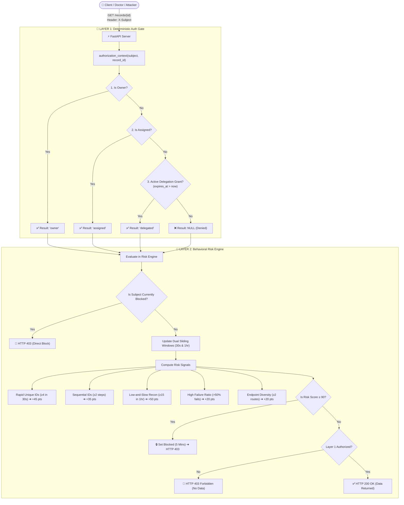

# CyberAccess: Deterministic-First Dual-Layer BOLA Defense

[](https://owasp.org/API-Security/editions/2023/en/0x11-t10/)
[](https://fastapi.tiangolo.com)
[](https://vitejs.dev)
[]()

> A production-grade prototype demonstrating a **Deterministic-First Dual-Layer Defense** against Broken Object Level Authorization (BOLA / IDOR) vulnerabilities in modern APIs.

---

## 📌 The Problem: OWASP #1 (BOLA / IDOR)

In modern web APIs, authentication (AuthN) verifies **identity**, but object-level authorization (AuthZ) verifies **data ownership**. 

Traditional API gateways and ML-first security tools (like Salt Security or Traceable AI) rely on probabilistic anomaly detection to identify BOLA attacks. This creates two critical failure modes:
1. **False Positives on Authorized Bursts:** When legitimate users (e.g., an on-call doctor covering an emergency ward) suddenly access dozens of new records, ML baselines flag them as anomalous and block critical workflows.
2. **Baseline Poisoning & Stealth Enumeration:** Attackers who probe slowly or leverage multiple identities (Sybil attacks) can blend into normal traffic and evade detection.

---

## 🛡️ Our Solution: Dual-Layer Defense

CyberAccess separates object authorization into two distinct, cooperative layers:

1. **Layer 1 (Deterministic Auth Gate):** Strictly verifies object access via hard SQL predicates (`WHERE subject_id = ? AND record_id = ?`) backed by dynamic, time-bound delegation tickets. If a valid ticket or ownership is absent, it immediately returns `403 Forbidden` with **zero data leakage**.
2. **Layer 2 (Behavioral Risk Engine):** An in-memory sliding-window telemetry engine that monitors failed attempts across dual time-windows (**30s short-burst** and **1-hour low-and-slow reconnaissance**) to dynamically calculate a risk score ($0 - 100$) and trigger automated lockouts for abusive actors.

---

## 🏗️ Architecture & Request Flow



---

## 📊 Behavioral Risk Scoring Matrix

$$\text{Risk Score} = \min\left(100, \sum \text{Tripped Signal Penalties}\right)$$

| Signal Name | Window | Threshold Condition | Penalty |
| :--- | :--- | :--- | :--- |
| `unauthorized_unique_object_pressure` | Short (30s) | $\ge 4$ unique failed record IDs | **+45 pts** |
| `sequential_id_enumeration` | Short (30s) | $\ge 2$ consecutive ID step increments | **+35 pts** |
| `low_and_slow_reconnaissance` | Long (1 hr) | $\ge 15$ unique failed record IDs | **+50 pts** |
| `high_failure_ratio` | Long (1 hr) | Failure rate $> 50\%$ with $> 5$ requests | **+20 pts** |
| `endpoint_diversity` | Long (1 hr) | Failures across $\ge 2$ distinct endpoints | **+20 pts** |

* **0 – 39 (Normal):** Allowed if Layer 1 passes.
* **40 – 69 (Suspicious):** Telemetry flagged; headers enriched with `X-Risk-Score`.
* **70 – 89 (High Risk):** Escalated telemetry event logged.
* **90 – 100 (Attack):** **Automatic 5-minute lockout** (`HTTP 403 outcome: blocked`).

---

## ⚔️ Competitor Comparison

| Capability | Traditional WAFs | Commercial ML API Security | **CyberAccess (This Project)** |
| :--- | :--- | :--- | :--- |
| **BOLA / IDOR Detection** | ❌ Blind (Cannot inspect object logic) | ⚠️ Probabilistic (Guesses anomalies) | ✅ **Deterministic-First (SQL Predicates)** |
| **False Positive Rate** | High on traffic spikes | Moderate on operational shift changes | ✅ **0% for authorized delegations** |
| **Baseline Poisoning** | N/A | ❌ Vulnerable to slow training | ✅ **Immune (Denials never create baseline edges)** |
| **Data Leak Guarantee** | None | Statistical | ✅ **Mathematical Lock ($O(1) = 0$ bytes stolen)** |

---

## 📁 Repository Structure

```
cyberaccess/
├── bola-benchmark/          # Backend FastAPI Engine & Verification Suite
│   ├── app.py               # Core FastAPI app, SQLite models & BehavioralRiskEngine
│   ├── test_detector.py     # 24 automated unit & security integration tests
│   ├── demo.db              # Pre-seeded SQLite database
│   ├── requirements.txt     # Python dependencies
│   └── EXTERNAL_VALIDATION.md # Reproducibility & audit instructions
└── bola-frontend/           # Modern React + Vite Dashboard & Live Simulator
    ├── src/                 # Interactive UI components & attack simulators
    ├── package.json         # Node.js dependencies
    └── tailwind.config.js   # UI Styling configuration
```

---

## 🚀 Quick Start Guide

### 1. Run Backend Server
```bash
cd bola-benchmark
python -m venv .venv
# Windows:
.\.venv\Scripts\activate
# Linux/macOS:
source .venv/bin/activate

pip install -r requirements.txt
uvicorn app:app --port 8000 --reload
```
* Interactive Swagger Docs: `http://127.0.0.1:8000/docs`

### 2. Run Frontend Dashboard
```bash
cd bola-frontend
npm install
npm run dev
```
* Access Dashboard: `http://localhost:5173`

### 3. Run Automated Security Test Suite
```bash
cd bola-benchmark
pytest test_detector.py -v
```

---

## 📜 License
This project is licensed under the MIT License.
