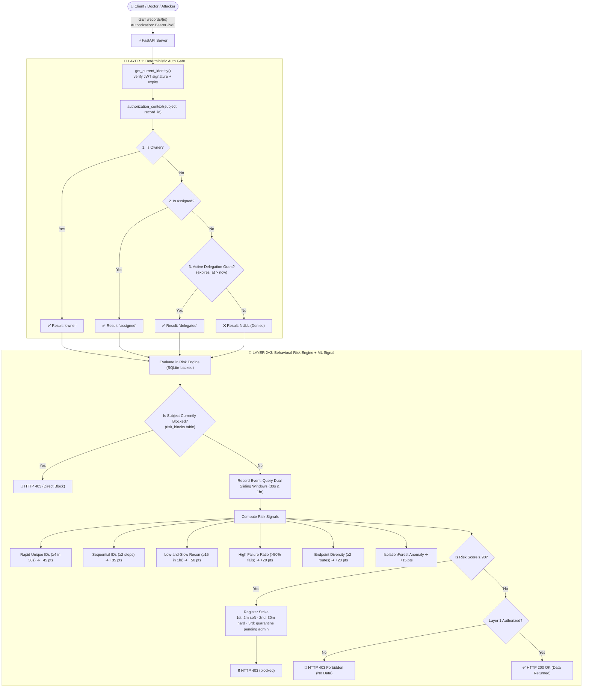

# CyberAccess: Deterministic-First Dual-Layer BOLA Defense

[](https://owasp.org/API-Security/editions/2023/en/0x11-t10/)
[](https://fastapi.tiangolo.com)
[](https://vitejs.dev)
[]()
[](bola-benchmark/Dockerfile)

> A **prototype** demonstrating a Deterministic-First Dual-Layer Defense against Broken Object Level Authorization (BOLA / IDOR) vulnerabilities in modern APIs — hardened with real JWT auth, persistent risk state, and an ML anomaly signal. Read the [Known Limitations](#️-known-limitations--honest-caveats) section before treating any of this as production-ready.

---

## 📌 The Problem: OWASP #1 (BOLA / IDOR)

In modern web APIs, authentication (AuthN) verifies **identity**, but object-level authorization (AuthZ) verifies **data ownership**.

Traditional API gateways and ML-first security tools (like Salt Security or Traceable AI) rely on probabilistic anomaly detection to identify BOLA attacks. This creates two critical failure modes:
1. **False Positives on Authorized Bursts:** When legitimate users (e.g., an on-call doctor covering an emergency ward) suddenly access dozens of new records, ML baselines flag them as anomalous and block critical workflows.
2. **Baseline Poisoning & Stealth Enumeration:** Attackers who probe slowly or leverage multiple identities (Sybil attacks) can blend into normal traffic and evade detection.

---

## 🛡️ Our Solution: Dual-Layer Defense + ML Signal

CyberAccess separates object authorization into two cooperative layers, plus an unsupervised ML layer that catches what the fixed rules structurally can't:

1. **Layer 1 (Deterministic Auth Gate):** Strictly verifies object access via hard SQL predicates (`WHERE subject_id = ? AND record_id = ?`) backed by dynamic, time-bound delegation tickets. If a valid ticket or ownership is absent, it immediately returns `403 Forbidden` with **zero data leakage** — and identical denial text whether the record exists or not, so existence can't be used as an oracle.
2. **Layer 2 (Behavioral Risk Engine):** A SQLite-persisted sliding-window telemetry engine that monitors failed attempts across dual time-windows (**30s short-burst** and **1-hour low-and-slow reconnaissance**) to dynamically calculate a risk score ($0$–$100$) and escalate through a **3-strike lockout ladder** with human-in-the-loop admin review at strike 3.
3. **Layer 3 (ML Anomaly Signal):** An `IsolationForest` (scikit-learn) scores the *combined shape* of a subject's behavior — catching combinations that stay just under every individual heuristic threshold. It's an additive signal, not the authorization decision; Layer 1 alone still gates every allow/deny.

---

## 🔐 Authentication

Every protected endpoint requires a **JWT bearer token** — there is no client-supplied identity header anymore.

```bash
# 1. Log in (all seeded demo accounts share DEMO_PASSWORD, default "changeme123")
curl -X POST http://127.0.0.1:8000/auth/login \
  -H "Content-Type: application/json" \
  -d '{"subject": "alice", "password": "changeme123"}'
# -> {"access_token": "...", "token_type": "bearer", "role": "customer", "expires_in": 3600}

# 2. Use the token
curl http://127.0.0.1:8000/records/1 -H "Authorization: Bearer <access_token>"
```

New identities register first via `POST /auth/register` (`{"subject", "password", "role"}`). The `security_admin` role (required for `/audit-events`, `/admin/*`, `/soc/*`) uses a separate `ADMIN_PASSWORD`. Passwords are bcrypt-hashed; tokens are HS256-signed with `JWT_SECRET`. All three are environment-overridable dev-only defaults — **the app refuses to boot with `APP_ENV=prod` unless every one of them has been changed**, and refuses to boot in `prod` with an unset CORS origin.

The React dashboard has a real login screen; the JWT lives only in memory (React state), never `localStorage`, and admin-only UI (audit feed, ban approval) only calls those endpoints when the logged-in user's own role is `security_admin`.

---

## 🏗️ Architecture & Request Flow



---

## 📊 Behavioral Risk Scoring Matrix

$$\text{Risk Score} = \min\left(100, \sum \text{Tripped Signal Penalties}\right)$$

| Signal Name | Window | Threshold Condition | Penalty |
| :--- | :--- | :--- | :--- |
| `unauthorized_unique_object_pressure` | Short (30s) | $\ge 4$ unique failed record IDs | **+45 pts** |
| `sequential_id_enumeration` | Short (30s) | $\ge 2$ consecutive ID step increments | **+35 pts** |
| `low_and_slow_reconnaissance` | Long (1 hr) | $\ge 15$ unique failed record IDs | **+50 pts** |
| `high_failure_ratio` | Long (1 hr) | Failure rate $> 50\%$ with $> 5$ requests | **+20 pts** |
| `endpoint_diversity` | Long (1 hr) | Failures across $\ge 2$ distinct endpoints | **+20 pts** |
| `ml_behavioral_anomaly` | Long (1 hr) | IsolationForest flags the feature vector as an outlier | **+15 pts** |

* **0 – 39 (Normal):** Allowed if Layer 1 passes.
* **40 – 69 (Suspicious):** Telemetry flagged; headers enriched with `X-Risk-Score`.
* **70 – 89 (High Risk):** Escalated telemetry event logged.
* **90 – 100 (Attack):** **3-strike escalation triggers** — see below.

### 3-Strike Escalation & Human-in-the-Loop Ban Approval

| Strike | Lockout | Who decides |
| :--- | :--- | :--- |
| 1st (within 1 hr) | 2-minute soft lockout | Automatic |
| 2nd (within 1 hr) | 30-minute hard lockout | Automatic |
| 3rd (within 1 hr) | Quarantined, pending review | **`security_admin` must approve or dismiss** via `POST /admin/approve-ban/{subject}` / `POST /admin/reject-ban/{subject}` |

No identity is ever permanently banned without a human decision. Every strike, ban approval, and dismissal is written to the append-only audit log.

---

## ⚔️ Competitor Comparison

| Capability | Traditional WAFs | Commercial ML API Security | **CyberAccess (This Project)** |
| :--- | :--- | :--- | :--- |
| **BOLA / IDOR Detection** | ❌ Blind (Cannot inspect object logic) | ⚠️ Probabilistic (Guesses anomalies) | ✅ **Deterministic-First (SQL Predicates)**, ML as a secondary signal only |
| **False Positive Rate** | High on traffic spikes | Moderate on operational shift changes | ✅ **0% for authorized delegations** (Layer 1 never depends on ML) |
| **Baseline Poisoning** | N/A | ❌ Vulnerable to slow training | ✅ **Immune (Denials never create baseline edges)** |
| **Data Leak Guarantee** | None | Statistical | ✅ **Mathematical Lock ($O(1) = 0$ bytes stolen)** |
| **Identity Layer** | N/A | Varies | ✅ **JWT + bcrypt**, not a spoofable header |

---

## 📁 Repository Structure

```
Build_with_Barath_2.0/
├── render.yaml               # Render.com one-click deployment blueprint
├── bola-benchmark/           # Backend FastAPI Engine & Verification Suite
│   ├── app.py                 # FastAPI app: JWT auth, SQL authorization, risk engine, ML signal
│   ├── test_detector.py       # 28 automated unit & security integration tests
│   ├── benchmark.py           # Reproducible scenario runner -> results/ (events.csv, metrics.json, warmup_curve.csv)
│   ├── Dockerfile              # Container build, /health check, persistent-disk aware (DB_DIR)
│   ├── .env.example            # JWT_SECRET / DEMO_PASSWORD / ADMIN_PASSWORD template
│   ├── demo.db                 # Pre-seeded SQLite database (users, records, risk state)
│   ├── audit.db                # Append-only audit log, separate from demo.db, survives /reset
│   ├── requirements.txt        # Python dependencies
│   └── EXTERNAL_VALIDATION.md  # Reproducibility & audit instructions
└── bola-frontend/            # React + Vite Dashboard & Live Simulator
    ├── src/App.tsx             # Login screen, SOC dashboard, attack simulators
    ├── package.json            # Node.js dependencies
    └── tailwind.config.js      # UI Styling configuration
```

---

## 🚀 Quick Start Guide

### 1. Run Backend Server
```bash
cd bola-benchmark
python -m venv .venv
# Windows:
.\.venv\Scripts\activate
# Linux/macOS:
source .venv/bin/activate

pip install -r requirements.txt
uvicorn app:app --port 8000 --reload
```
* Interactive Swagger Docs: `http://127.0.0.1:8000/docs`
* Health check: `http://127.0.0.1:8000/health`
* Demo credentials (dev defaults, override via `.env` — see `bola-benchmark/.env.example`): any seeded user (`alice`, `bob`, `dr_singh`, `attacker_1`, ...) with password `changeme123`; `security_admin` with password `admin_changeme123`.

### 2. Run Frontend Dashboard
```bash
cd bola-frontend
npm install
npm run dev
```
* Access Dashboard: `http://localhost:5173`
* Log in with any seeded demo account (see above) to reach the SOC dashboard.

### 3. Run Automated Security Test Suite
```bash
cd bola-benchmark
pytest test_detector.py -v
```

### 4. Run in Docker
```bash
cd bola-benchmark
docker build -t cyberaccess-backend .
docker run -p 8000:8000 -v cyberaccess-data:/app/data cyberaccess-backend
```

### 5. Deploy to Render
A `render.yaml` blueprint is included at the repo root for one-click deployment of both services. Before using it for anything beyond a throwaway demo, set `APP_ENV=prod` plus real `JWT_SECRET` / `DEMO_PASSWORD` / `ADMIN_PASSWORD` / `FRONTEND_ORIGIN` values on the backend service and attach a persistent disk at `DB_DIR` — the app **will refuse to boot** in `prod` mode until the secrets and CORS origin are set, by design.

---

## ⚠️ Known Limitations & Honest Caveats

This is a **synthetic prototype**, and we'd rather state its limits plainly than have a reviewer find them first:

* **Identity is now real, but demo-grade.** `POST /auth/register` + `POST /auth/login` issue signed JWT bearer tokens (HS256, bcrypt-hashed passwords) and every protected endpoint verifies them server-side. `JWT_SECRET`, `DEMO_PASSWORD`, and `ADMIN_PASSWORD` are dev-only defaults read from environment variables; the app refuses to boot with `APP_ENV=prod` until they're rotated.
* **All traffic is synthetic.** Every number in this README (0% false positives, detection thresholds, etc.) comes from data generated via `/simulate/*` and `benchmark.py`. It has not been validated against real-world API traffic. See `bola-benchmark/EXTERNAL_VALIDATION.md` for the protocol to get an independent, non-self-graded rerun.
* **The ML anomaly layer does not learn or adapt.** The `IsolationForest` model is trained once, at process startup, on synthetic feature vectors — it is frozen for the life of the process, has never seen real traffic, and has no retraining loop, no feedback from admin ban/dismiss decisions, and no model versioning. "AI-powered" here means "one static unsupervised model as a secondary signal," not an adaptive or self-improving system.
* **`/reset` and `/simulate/*` stay unauthenticated in `DEMO_MODE`** (the default) so the dashboard's Reset and Attack Simulator buttons work without login. Setting `DEMO_MODE=false` gates both behind a `security_admin` JWT. Every genuinely sensitive endpoint (`/admin/*`, `/soc/*`, `/audit-events`) already requires one unconditionally.
* **State is SQLite-backed and persistent**, not in-memory. The behavioral risk engine's sliding windows, strikes, blocks, and ban status live in `demo.db` — a server restart no longer clears risk history. Horizontal scaling across multiple API instances still isn't addressed (SQLite has no built-in replication); a real multi-instance deployment would move this to Redis or a shared database.
* **A basic transport-layer rate limiter is in place** (`slowapi`, keyed by authenticated subject where available, IP otherwise). Limits are set generously for demo/test traffic (up to 1000/min on hot paths), not tuned for production load.
* **The audit log is append-only and separate from the demo dataset** (`audit.db`, distinct file from `demo.db`) so `/reset` can no longer wipe incident history along with the seed data. It has no pagination yet (`/audit-events` returns the most recent 100).
* **No live/hosted demo yet.** A `render.yaml` blueprint exists for one-click deployment, but there is no permanently-running deployed URL at this time.
* **SQLite is a demo choice, not a scale choice.** The dataset (100 records, ~70 users) is small and fits in a single file; the authorization queries would need to be re-validated against a production-scale schema and index plan (Postgres + SQLAlchemy + migrations, most likely).
* **No token revocation.** A leaked JWT stays valid until it expires (`JWT_EXPIRY_SECONDS`, default 1 hour) — there is no blocklist or session-invalidation mechanism yet.

---

## 📜 License
This project is licensed under the MIT License.
